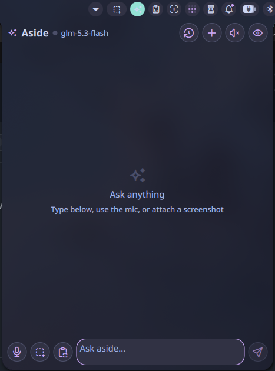

# Aside widget for Noctalia Shell

A [Noctalia](https://noctalia.dev) bar widget/panel that integrates
[aside](https://aur.archlinux.org/packages/aside) — the Wayland-native LLM
desktop assistant — directly into your shell.



## Features

- **Bar capsule** — sparkles icon with live daemon state: idle / thinking /
  tool use / speaking (color + pulsing dot), tooltip with status & model.
- **Conversation panel** — full transcript of the active aside conversation
  with markdown rendering, auto-scroll, and a thinking/stop indicator.
- **Query** — type & send with Enter (Shift+Enter for newline).
- **Overlay suppression** — aside's native overlay normally pops up for every
  query; the widget hides it again so only the panel shows the reply
  (configurable, voice capture still uses the overlay for feedback).
- **Screenshot input** — select a screen region with slurp; the panel closes
  while selecting and reopens with the image attached. The image is
  downscaled & optimized for aside's daemon socket.
- **Clipboard image input** — attach an image straight from the clipboard.
- **Voice input** — one-shot mic capture through aside's STT
  (`aside query --mic` / `aside reply --mic <id>`); the aside overlay shows
  live transcription feedback.
- **History** — browse, pin, and delete recent conversations.
- **Extras** — new chat, TTS toggle, open the conversation in aside's native
  overlay, automatic daemon startup.

## Requirements

| Package | Purpose |
| --- | --- |
| `aside` | daemon + CLI (with API keys configured via `aside set-key`) |
| `grim`, `slurp` | screenshot capture |
| `wl-clipboard` | clipboard image attach |
| `python-pillow` | screenshot downscaling (daemon accepts ≤ 64 KB per socket message) |
| aside STT packages (`sudo aside enable-stt`) | voice input |

## Install

Copy or symlink this folder into the noctalia plugin directory:

```sh
cp -r aside-niri-widget ~/.config/noctalia/plugins/aside
# or, for development:
ln -s ~/Projects/aside-niri-widget ~/.config/noctalia/plugins/aside
```

Then open **Noctalia Settings → Plugins**, enable **Aside**, and add the
widget to a bar section. Restart noctalia (`niri msg action ...` or re-login)
if it does not appear immediately.

## Keybinds

Add these to your niri config to drive the widget globally:

```kdl
binds {
    Mod+A { spawn "qs" "ipc" "call" "plugin:aside" "toggle"; }
    Mod+V { spawn "qs" "ipc" "call" "plugin:aside" "voice"; }
    Mod+S { spawn "qs" "ipc" "call" "plugin:aside" "screenshot"; }
}
```

Available IPC functions: `toggle`, `query <text>`, `voice`, `screenshot`,
`cancel`.

## How it works

- Daemon state is read directly from `~/.local/state/aside/`
  (`status.json`, `last.json`, `conversations/*.json`) with file watchers,
  so transcripts update live as queries finish.
- Queries (including image attachments) are sent to the daemon over its
  unix socket via `scripts/aside-bridge.py`, because the aside CLI does not
  expose image input.
- Images are progressively downscaled/re-encoded until their base64 payload
  fits the daemon's 64 KB socket read limit.

## Notes

- The screenshot closes the panel, opens slurp's region picker, then reopens
  the panel with the image attached — add a prompt (or none — the "default
  image prompt" setting is used) and send.
- With "Hide aside overlay on send" enabled the native overlay may flash
  briefly when a query starts; it is hidden again automatically.
